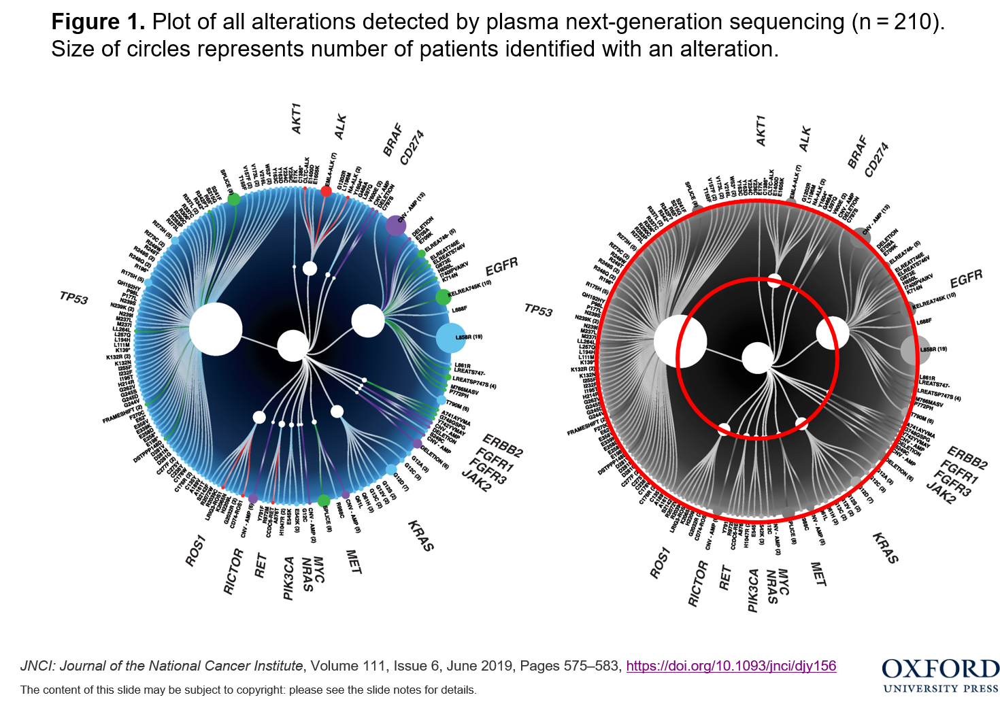
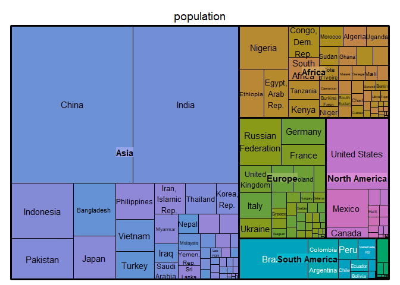
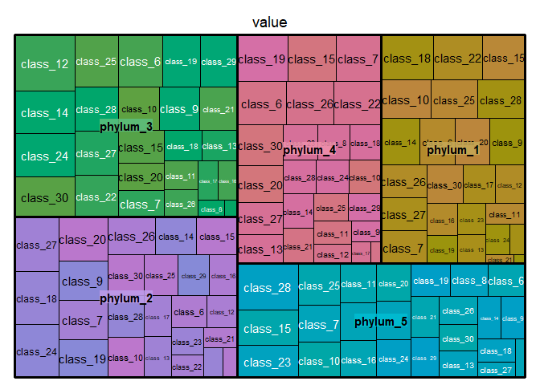
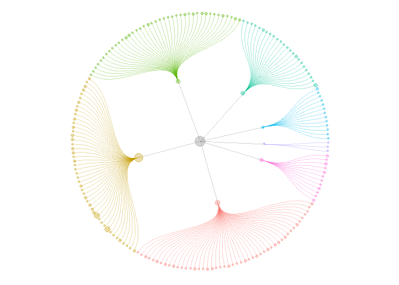
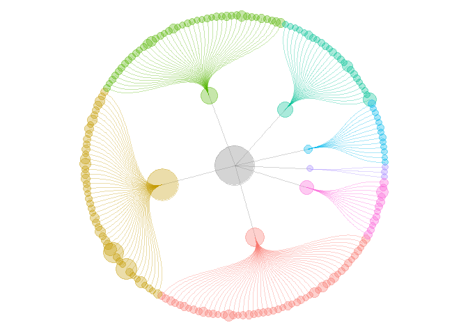
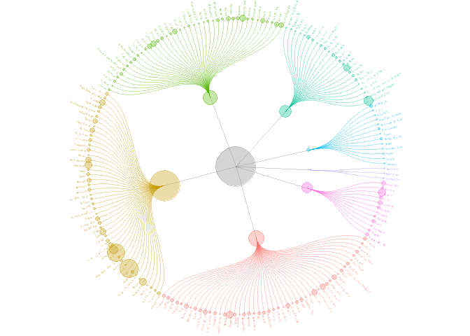
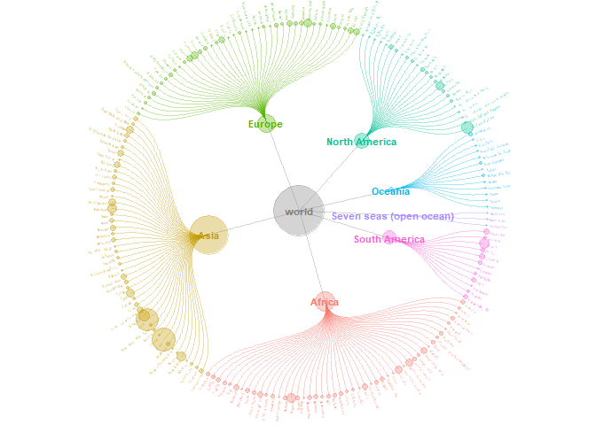
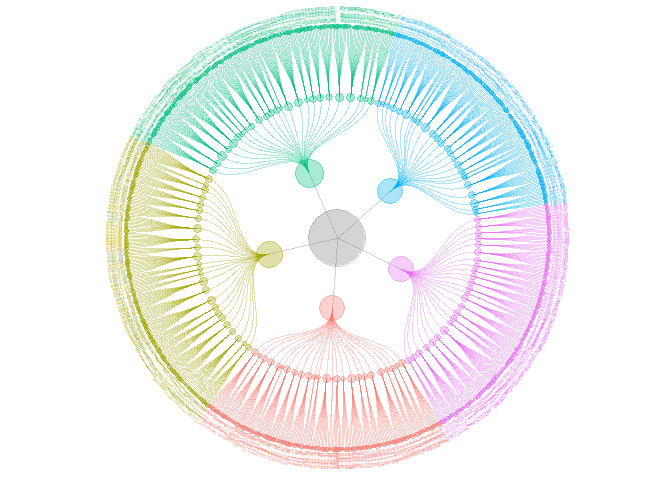
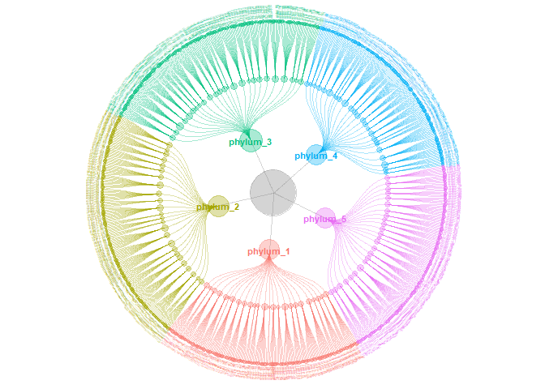
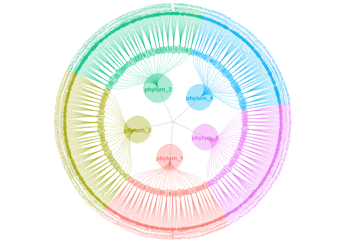

<!-- README.md is generated from README.Rmd. Please edit that file -->

# ccgraph

<!-- badges: start -->

<!-- badges: end -->

*严格意义上说，`ccgraph` 并不是一个真正意义上的 “包”。我们选择以 Package 的形式发布，是为了方便使用和传播。*

`ccgraph` 中的 `cc` 是 `circle circle` 的意思，`graph` 是 **图**，意味着使用它可以在 R
环境下绘制 “圆环套圆环” 的 “图”。

之所以把 “图” 加粗，是因为此图非一般意义上的图，而特指图论中描述的图，即对应英文中的 “graph”。

“圆环套圆环”的说法来自于电影《无极》，以及搞笑片“一个馒头引发的血案”。没有看过的不妨去看看。

## 载入需要的包

``` r
# load packages
library(tidyverse)
#> -- Attaching packages --------------------------------------- tidyverse 1.2.1 --
#> √ tibble  2.1.3     √ purrr   0.3.3
#> √ tidyr   1.0.0     √ stringr 1.4.0
#> √ readr   1.3.1     √ forcats 0.4.0
#> -- Conflicts ------------------------------------------ tidyverse_conflicts() --
#> x tidygraph::filter() masks dplyr::filter(), stats::filter()
#> x dplyr::lag()        masks stats::lag()
library(ggraph)
```

## 图的说明

这个图来自于 [这篇文献](https://doi.org/10.1093/jnci/djy156) 的 Figure 1。
原文的用途是标明测序在若干基因发现的 SNP/Indel/CNV 突变（多态性差异）。 例如，在
TP53 基因中发现了最多的多态性，包括 CNV 差异 SPLICE 8 个，单核苷酸位点差异 R273H 5 个等。
由于差异用点的大小表示，所以很容易发现常见的多态性差异。



稍作观察便可发现，本图是一个“圆环套圆环”的布局，中心处在中央，下一级的项目分别处在外环。图中只有二环，如果要扩展成五环，多显示几个层次应该也不错。

因此，本图也使用用于展示其它类型的的层级结构。例如上游调控因子调控下游基因的层级和强度，宏基因组测序中发现的物种的丰度等信息。

## 输入数据格式

**FuncTree**
工具(<https://bioviz.tokyo/functree)可以出类似这样的图，但是它的输入数据格式非常复杂（见下表>）。需要针对每一个点做有针对性的设置。

| Input                             | Description                                                             |
| --------------------------------- | ----------------------------------------------------------------------- |
| n-map00010 v-120                  | map circle of size 120 on node “map00010”                               |
| n-1881 v-78 o-0.3                 | map circle of size 78 with opacity value 0.3 on node “1881” (“M00281”)  |
| n-map00030 v-12                   | map circle of size 120 with default opacity value(1) on node “map00030” |
| n-map00190 v-149 o-0.9 c-\#ff0000 | map red circle of size 149 with opacity value 0.9 on node “map00149”    |

**[tidytuesday](https://github.com/spren9er/tidytuesday)**
提供了一个挺酷炫的解决方案，应该是个正确的努力方向。

所以决定用 `ggraph` 来画这个图。为此，花了几天时间仔细研究了这个包，写下了一篇长文：[一文读懂 ggraph
的使用](https://mp.weixin.qq.com/s/XYVW7wzJIPaHCpBR7j3coQ)

上面提到，树状的结构在生活中很常见。本来想用文献中的数据重现图片，但是无奈上面的文献中没有提供原始数据。于是选了两个数据在开发中验证功能。

一个数据是 `treemap` 附带的 `GNI2014` 数据。 这个数据是 2014 年以美元计算的人均国民总收入和每个国家的人口总数。

**祝贺澳门特别行政区跻身前五名。**

``` r
library(treemap)
data("GNI2014")

library(gt)
GNI2014 %>% arrange(desc(GNI)) %>% head(30) %>%
  gt() %>% 
  tab_header(title = "Gross national income and population totals",
             subtitle = "(in 2014)") %>%
  fmt_currency("GNI",decimals = 0) %>%
  fmt_number("population",decimals = 0)
```

<!--html_preserve-->

<style>html {
  font-family: -apple-system, BlinkMacSystemFont, 'Segoe UI', Roboto, Oxygen, Ubuntu, Cantarell, 'Helvetica Neue', 'Fira Sans', 'Droid Sans', Arial, sans-serif;
}

#wzbuqslgaa .gt_table {
  display: table;
  border-collapse: collapse;
  margin-left: auto;
  margin-right: auto;
  color: #000000;
  font-size: 16px;
  background-color: #FFFFFF;
  /* table.background.color */
  width: auto;
  /* table.width */
  border-top-style: solid;
  /* table.border.top.style */
  border-top-width: 2px;
  /* table.border.top.width */
  border-top-color: #A8A8A8;
  /* table.border.top.color */
}

#wzbuqslgaa .gt_heading {
  background-color: #FFFFFF;
  /* heading.background.color */
  border-bottom-color: #FFFFFF;
}

#wzbuqslgaa .gt_title {
  color: #000000;
  font-size: 125%;
  /* heading.title.font.size */
  padding-top: 4px;
  /* heading.top.padding */
  padding-bottom: 1px;
  border-bottom-color: #FFFFFF;
  border-bottom-width: 0;
}

#wzbuqslgaa .gt_subtitle {
  color: #000000;
  font-size: 85%;
  /* heading.subtitle.font.size */
  padding-top: 1px;
  padding-bottom: 4px;
  /* heading.bottom.padding */
  border-top-color: #FFFFFF;
  border-top-width: 0;
}

#wzbuqslgaa .gt_bottom_border {
  border-bottom-style: solid;
  /* heading.border.bottom.style */
  border-bottom-width: 2px;
  /* heading.border.bottom.width */
  border-bottom-color: #A8A8A8;
  /* heading.border.bottom.color */
}

#wzbuqslgaa .gt_column_spanner {
  border-bottom-style: solid;
  border-bottom-width: 2px;
  border-bottom-color: #A8A8A8;
  padding-top: 4px;
  padding-bottom: 4px;
}

#wzbuqslgaa .gt_col_heading {
  color: #000000;
  background-color: #FFFFFF;
  /* column_labels.background.color */
  font-size: 16px;
  /* column_labels.font.size */
  font-weight: initial;
  /* column_labels.font.weight */
  vertical-align: middle;
  padding: 10px;
  margin: 10px;
}

#wzbuqslgaa .gt_sep_right {
  border-right: 5px solid #FFFFFF;
}

#wzbuqslgaa .gt_group_heading {
  padding: 8px;
  color: #000000;
  background-color: #FFFFFF;
  /* stub_group.background.color */
  font-size: 16px;
  /* stub_group.font.size */
  font-weight: initial;
  /* stub_group.font.weight */
  border-top-style: solid;
  /* stub_group.border.top.style */
  border-top-width: 2px;
  /* stub_group.border.top.width */
  border-top-color: #A8A8A8;
  /* stub_group.border.top.color */
  border-bottom-style: solid;
  /* stub_group.border.bottom.style */
  border-bottom-width: 2px;
  /* stub_group.border.bottom.width */
  border-bottom-color: #A8A8A8;
  /* stub_group.border.bottom.color */
  vertical-align: middle;
}

#wzbuqslgaa .gt_empty_group_heading {
  padding: 0.5px;
  color: #000000;
  background-color: #FFFFFF;
  /* stub_group.background.color */
  font-size: 16px;
  /* stub_group.font.size */
  font-weight: initial;
  /* stub_group.font.weight */
  border-top-style: solid;
  /* stub_group.border.top.style */
  border-top-width: 2px;
  /* stub_group.border.top.width */
  border-top-color: #A8A8A8;
  /* stub_group.border.top.color */
  border-bottom-style: solid;
  /* stub_group.border.bottom.style */
  border-bottom-width: 2px;
  /* stub_group.border.bottom.width */
  border-bottom-color: #A8A8A8;
  /* stub_group.border.bottom.color */
  vertical-align: middle;
}

#wzbuqslgaa .gt_striped {
  background-color: #f2f2f2;
}

#wzbuqslgaa .gt_row {
  padding: 10px;
  /* row.padding */
  margin: 10px;
  vertical-align: middle;
}

#wzbuqslgaa .gt_stub {
  border-right-style: solid;
  border-right-width: 2px;
  border-right-color: #A8A8A8;
  padding-left: 12px;
}

#wzbuqslgaa .gt_stub.gt_row {
  background-color: #FFFFFF;
}

#wzbuqslgaa .gt_summary_row {
  background-color: #FFFFFF;
  /* summary_row.background.color */
  padding: 6px;
  /* summary_row.padding */
  text-transform: inherit;
  /* summary_row.text_transform */
}

#wzbuqslgaa .gt_first_summary_row {
  border-top-style: solid;
  border-top-width: 2px;
  border-top-color: #A8A8A8;
}

#wzbuqslgaa .gt_table_body {
  border-top-style: solid;
  /* field.border.top.style */
  border-top-width: 2px;
  /* field.border.top.width */
  border-top-color: #A8A8A8;
  /* field.border.top.color */
  border-bottom-style: solid;
  /* field.border.bottom.style */
  border-bottom-width: 2px;
  /* field.border.bottom.width */
  border-bottom-color: #A8A8A8;
  /* field.border.bottom.color */
}

#wzbuqslgaa .gt_footnote {
  font-size: 90%;
  /* footnote.font.size */
  padding: 4px;
  /* footnote.padding */
}

#wzbuqslgaa .gt_sourcenote {
  font-size: 90%;
  /* sourcenote.font.size */
  padding: 4px;
  /* sourcenote.padding */
}

#wzbuqslgaa .gt_center {
  text-align: center;
}

#wzbuqslgaa .gt_left {
  text-align: left;
}

#wzbuqslgaa .gt_right {
  text-align: right;
  font-variant-numeric: tabular-nums;
}

#wzbuqslgaa .gt_font_normal {
  font-weight: normal;
}

#wzbuqslgaa .gt_font_bold {
  font-weight: bold;
}

#wzbuqslgaa .gt_font_italic {
  font-style: italic;
}

#wzbuqslgaa .gt_super {
  font-size: 65%;
}

#wzbuqslgaa .gt_footnote_glyph {
  font-style: italic;
  font-size: 65%;
}
</style>

<div id="wzbuqslgaa" style="overflow-x:auto;">

<!--gt table start-->

<table class="gt_table">

<thead>

<tr>

<th colspan="5" class="gt_heading gt_title gt_font_normal gt_center">

Gross national income and population totals

</th>

</tr>

<tr>

<th colspan="5" class="gt_heading gt_subtitle gt_font_normal gt_center gt_bottom_border">

(in 2014)

</th>

</tr>

</thead>

<tr>

<th class="gt_col_heading gt_left" rowspan="1" colspan="1">

iso3

</th>

<th class="gt_col_heading gt_left" rowspan="1" colspan="1">

country

</th>

<th class="gt_col_heading gt_center" rowspan="1" colspan="1">

continent

</th>

<th class="gt_col_heading gt_right" rowspan="1" colspan="1">

population

</th>

<th class="gt_col_heading gt_right" rowspan="1" colspan="1">

GNI

</th>

</tr>

<tbody class="gt_table_body">

<tr>

<td class="gt_row gt_left">

BMU

</td>

<td class="gt_row gt_left">

Bermuda

</td>

<td class="gt_row gt_center">

North America

</td>

<td class="gt_row gt_right">

67,837

</td>

<td class="gt_row gt_right">

$106,140

</td>

</tr>

<tr>

<td class="gt_row gt_left gt_striped">

NOR

</td>

<td class="gt_row gt_left gt_striped">

Norway

</td>

<td class="gt_row gt_center gt_striped">

Europe

</td>

<td class="gt_row gt_right gt_striped">

4,676,305

</td>

<td class="gt_row gt_right gt_striped">

$103,630

</td>

</tr>

<tr>

<td class="gt_row gt_left">

QAT

</td>

<td class="gt_row gt_left">

Qatar

</td>

<td class="gt_row gt_center">

Asia

</td>

<td class="gt_row gt_right">

833,285

</td>

<td class="gt_row gt_right">

$92,200

</td>

</tr>

<tr>

<td class="gt_row gt_left gt_striped">

CHE

</td>

<td class="gt_row gt_left gt_striped">

Switzerland

</td>

<td class="gt_row gt_center gt_striped">

Europe

</td>

<td class="gt_row gt_right gt_striped">

7,604,467

</td>

<td class="gt_row gt_right gt_striped">

$88,120

</td>

</tr>

<tr>

<td class="gt_row gt_left">

MAC

</td>

<td class="gt_row gt_left">

Macao SAR, China

</td>

<td class="gt_row gt_center">

Asia

</td>

<td class="gt_row gt_right">

559,846

</td>

<td class="gt_row gt_right">

$76,270

</td>

</tr>

<tr>

<td class="gt_row gt_left gt_striped">

LUX

</td>

<td class="gt_row gt_left gt_striped">

Luxembourg

</td>

<td class="gt_row gt_center gt_striped">

Europe

</td>

<td class="gt_row gt_right gt_striped">

491,775

</td>

<td class="gt_row gt_right gt_striped">

$75,990

</td>

</tr>

<tr>

<td class="gt_row gt_left">

AUS

</td>

<td class="gt_row gt_left">

Australia

</td>

<td class="gt_row gt_center">

Oceania

</td>

<td class="gt_row gt_right">

21,262,641

</td>

<td class="gt_row gt_right">

$64,540

</td>

</tr>

<tr>

<td class="gt_row gt_left gt_striped">

SWE

</td>

<td class="gt_row gt_left gt_striped">

Sweden

</td>

<td class="gt_row gt_center gt_striped">

Europe

</td>

<td class="gt_row gt_right gt_striped">

9,059,651

</td>

<td class="gt_row gt_right gt_striped">

$61,610

</td>

</tr>

<tr>

<td class="gt_row gt_left">

DNK

</td>

<td class="gt_row gt_left">

Denmark

</td>

<td class="gt_row gt_center">

Europe

</td>

<td class="gt_row gt_right">

5,500,510

</td>

<td class="gt_row gt_right">

$61,310

</td>

</tr>

<tr>

<td class="gt_row gt_left gt_striped">

USA

</td>

<td class="gt_row gt_left gt_striped">

United States

</td>

<td class="gt_row gt_center gt_striped">

North America

</td>

<td class="gt_row gt_right gt_striped">

313,973,000

</td>

<td class="gt_row gt_right gt_striped">

$55,200

</td>

</tr>

<tr>

<td class="gt_row gt_left">

SGP

</td>

<td class="gt_row gt_left">

Singapore

</td>

<td class="gt_row gt_center">

Asia

</td>

<td class="gt_row gt_right">

4,657,542

</td>

<td class="gt_row gt_right">

$55,150

</td>

</tr>

<tr>

<td class="gt_row gt_left gt_striped">

NLD

</td>

<td class="gt_row gt_left gt_striped">

Netherlands

</td>

<td class="gt_row gt_center gt_striped">

Europe

</td>

<td class="gt_row gt_right gt_striped">

16,715,999

</td>

<td class="gt_row gt_right gt_striped">

$51,890

</td>

</tr>

<tr>

<td class="gt_row gt_left">

CAN

</td>

<td class="gt_row gt_left">

Canada

</td>

<td class="gt_row gt_center">

North America

</td>

<td class="gt_row gt_right">

33,487,208

</td>

<td class="gt_row gt_right">

$51,630

</td>

</tr>

<tr>

<td class="gt_row gt_left gt_striped">

AUT

</td>

<td class="gt_row gt_left gt_striped">

Austria

</td>

<td class="gt_row gt_center gt_striped">

Europe

</td>

<td class="gt_row gt_right gt_striped">

8,210,281

</td>

<td class="gt_row gt_right gt_striped">

$49,670

</td>

</tr>

<tr>

<td class="gt_row gt_left">

KWT

</td>

<td class="gt_row gt_left">

Kuwait

</td>

<td class="gt_row gt_center">

Asia

</td>

<td class="gt_row gt_right">

2,691,158

</td>

<td class="gt_row gt_right">

$49,300

</td>

</tr>

<tr>

<td class="gt_row gt_left gt_striped">

FIN

</td>

<td class="gt_row gt_left gt_striped">

Finland

</td>

<td class="gt_row gt_center gt_striped">

Europe

</td>

<td class="gt_row gt_right gt_striped">

5,250,275

</td>

<td class="gt_row gt_right gt_striped">

$48,420

</td>

</tr>

<tr>

<td class="gt_row gt_left">

DEU

</td>

<td class="gt_row gt_left">

Germany

</td>

<td class="gt_row gt_center">

Europe

</td>

<td class="gt_row gt_right">

82,329,758

</td>

<td class="gt_row gt_right">

$47,640

</td>

</tr>

<tr>

<td class="gt_row gt_left gt_striped">

BEL

</td>

<td class="gt_row gt_left gt_striped">

Belgium

</td>

<td class="gt_row gt_center gt_striped">

Europe

</td>

<td class="gt_row gt_right gt_striped">

10,414,336

</td>

<td class="gt_row gt_right gt_striped">

$47,260

</td>

</tr>

<tr>

<td class="gt_row gt_left">

IRL

</td>

<td class="gt_row gt_left">

Ireland

</td>

<td class="gt_row gt_center">

Europe

</td>

<td class="gt_row gt_right">

4,203,200

</td>

<td class="gt_row gt_right">

$46,550

</td>

</tr>

<tr>

<td class="gt_row gt_left gt_striped">

ISL

</td>

<td class="gt_row gt_left gt_striped">

Iceland

</td>

<td class="gt_row gt_center gt_striped">

Europe

</td>

<td class="gt_row gt_right gt_striped">

306,694

</td>

<td class="gt_row gt_right gt_striped">

$46,350

</td>

</tr>

<tr>

<td class="gt_row gt_left">

ARE

</td>

<td class="gt_row gt_left">

United Arab Emirates

</td>

<td class="gt_row gt_center">

Asia

</td>

<td class="gt_row gt_right">

4,798,491

</td>

<td class="gt_row gt_right">

$44,600

</td>

</tr>

<tr>

<td class="gt_row gt_left gt_striped">

GBR

</td>

<td class="gt_row gt_left gt_striped">

United Kingdom

</td>

<td class="gt_row gt_center gt_striped">

Europe

</td>

<td class="gt_row gt_right gt_striped">

62,262,000

</td>

<td class="gt_row gt_right gt_striped">

$43,430

</td>

</tr>

<tr>

<td class="gt_row gt_left">

ADO

</td>

<td class="gt_row gt_left">

Andorra

</td>

<td class="gt_row gt_center">

Europe

</td>

<td class="gt_row gt_right">

79,218

</td>

<td class="gt_row gt_right">

$43,270

</td>

</tr>

<tr>

<td class="gt_row gt_left gt_striped">

FRA

</td>

<td class="gt_row gt_left gt_striped">

France

</td>

<td class="gt_row gt_center gt_striped">

Europe

</td>

<td class="gt_row gt_right gt_striped">

64,057,792

</td>

<td class="gt_row gt_right gt_striped">

$42,960

</td>

</tr>

<tr>

<td class="gt_row gt_left">

JPN

</td>

<td class="gt_row gt_left">

Japan

</td>

<td class="gt_row gt_center">

Asia

</td>

<td class="gt_row gt_right">

127,078,679

</td>

<td class="gt_row gt_right">

$42,000

</td>

</tr>

<tr>

<td class="gt_row gt_left gt_striped">

NZL

</td>

<td class="gt_row gt_left gt_striped">

New Zealand

</td>

<td class="gt_row gt_center gt_striped">

Oceania

</td>

<td class="gt_row gt_right gt_striped">

4,213,418

</td>

<td class="gt_row gt_right gt_striped">

$41,070

</td>

</tr>

<tr>

<td class="gt_row gt_left">

HKG

</td>

<td class="gt_row gt_left">

Hong Kong SAR, China

</td>

<td class="gt_row gt_center">

Asia

</td>

<td class="gt_row gt_right">

7,061,200

</td>

<td class="gt_row gt_right">

$40,320

</td>

</tr>

<tr>

<td class="gt_row gt_left gt_striped">

BRN

</td>

<td class="gt_row gt_left gt_striped">

Brunei Darussalam

</td>

<td class="gt_row gt_center gt_striped">

Asia

</td>

<td class="gt_row gt_right gt_striped">

388,190

</td>

<td class="gt_row gt_right gt_striped">

$37,320

</td>

</tr>

<tr>

<td class="gt_row gt_left">

ISR

</td>

<td class="gt_row gt_left">

Israel

</td>

<td class="gt_row gt_center">

Asia

</td>

<td class="gt_row gt_right">

7,233,701

</td>

<td class="gt_row gt_right">

$35,320

</td>

</tr>

<tr>

<td class="gt_row gt_left gt_striped">

ITA

</td>

<td class="gt_row gt_left gt_striped">

Italy

</td>

<td class="gt_row gt_center gt_striped">

Europe

</td>

<td class="gt_row gt_right gt_striped">

58,126,212

</td>

<td class="gt_row gt_right gt_striped">

$34,270

</td>

</tr>

</tbody>

</table>

<!--gt table end-->

</div>

<!--/html_preserve-->

另一个数据是随机生成的一个 OTU 表。

``` r
n <- 1000
microbiome <- data.frame(
  otu = paste("OTU",1:n,sep="_"),
  phylum = sample(paste("phylum",1:5,sep="_"),n,replace = T),
  class = sample(paste("class",6:30,sep="_"),n,replace=T),
  order = sample(paste("order",31:80,sep="_"),n,replace = T),
  value = runif(n,min=1,max=1000)
)
```

这两个数据都可以使用 `treemap()` 来做一个可视化。

``` r
treemap(GNI2014,index=c("continent","country"),vSize = "population")
```



``` r
treemap(microbiome,index = c("phylum","class"),vSize = "value")
```



# 数据处理

图由两个部分组成，节点（node）和边（edge）。处理数据就是要从上面的数据框中采集节点和边的信息。

为此，我分别写了两个函数：`gather_graph_node()` 和 `gather_graph_edge()` 来完成这一个任务。

这两个函数的参数设置借鉴了上面 `treemap()` 的实现方式。

  - `df`：一个数据框
  - `index`：一个索引项（分组项）
  - `value`：要采集的数值

<!-- end list -->

``` r
country_index <- c("continent","country")
nodes_country <- gather_graph_node(GNI2014,index = country_index, value = "population",root="world")
edges_country <- gather_graph_edge(GNI2014,index = country_index,root="world")
```

为了确保 `node.name` 的唯一性，在图中使用了长名，而把原有的名字放在 `node.short_name` 中去了。

`node.level` 则用来指示节点应该处于第几个圆环。

``` r
head(nodes_country,10)
#>                  node.name  node.size node.level node.count         node.short_name
#> 1                    world 6683146875       <NA>          1                   world
#> 2                   Africa  962382035  continent         48                  Africa
#> 3                     Asia 4033277009  continent         47                    Asia
#> 4                   Europe  728669949  continent         41                  Europe
#> 5            North America  528748158  continent         24           North America
#> 6                  Oceania   33949312  continent         13                 Oceania
#> 7  Seven seas (open ocean)    1768074  continent          3 Seven seas (open ocean)
#> 8            South America  394352338  continent         12           South America
#> 9           Africa/Algeria   34178188    country          1                 Algeria
#> 10            Africa/Benin    8791832    country          1                   Benin
#>                node.branch
#> 1                     <NA>
#> 2                   Africa
#> 3                     Asia
#> 4                   Europe
#> 5            North America
#> 6                  Oceania
#> 7  Seven seas (open ocean)
#> 8            South America
#> 9                   Africa
#> 10                  Africa
```

节点的属性统一以 `node` 作为前缀，而边的属性则以 `edge` 作为前缀。

``` r
head(edges_country,10)
#> # A tibble: 10 x 2
#>    from          to                     
#>    <chr>         <chr>                  
#>  1 world         Africa                 
#>  2 world         Asia                   
#>  3 world         Europe                 
#>  4 world         North America          
#>  5 world         Oceania                
#>  6 world         Seven seas (open ocean)
#>  7 world         South America          
#>  8 North America North America/Bermuda  
#>  9 Europe        Europe/Norway          
#> 10 Asia          Asia/Qatar
```

# 可视化

有了节点和边的数据，使用 `tbl_graph()` 便可以得到一个图。

``` r
library(tidygraph)
graph_country <- tbl_graph(nodes_country,edges_country)
```

然后使用 `ggraph` 出图，基本上就是这个意思了。

``` r
gc <- ggraph(graph_country,layout = 'dendrogram', circular = TRUE) + 
  geom_edge_diagonal(aes(color=node1.node.branch),alpha=1/3) + 
  geom_node_point(aes(size=node.size,color=node.branch),alpha=1/3) + 
  coord_fixed() +
  theme(legend.position = "none")

gc
```



当然，要想达到示例图片中的效果，还需要做一些修饰。

## 搞大你的点

使用 `scale_size()` 和 `scale_size_*()` 系列函数可以搞大你的点。

[搞大你的点](https://mp.weixin.qq.com/s/JNIncz3W-59yjGk2ibJWUw)

``` r
gc + scale_size(range = c(3,20))
```



## 添加注释文字

### 外环文字

``` r
gc + scale_size(range = c(0.5,20)) +
      geom_node_text(
      aes(
        x = 1.0175 * x,
        y = 1.0175 * y,
        label = node.short_name,
        angle = -((-node_angle(x, y) + 90) %% 180) + 90,
        filter = leaf,
        color = node.branch
      ),
      size = 1, hjust = 'outward'
    )
```



### 内环文字

``` r
gc + scale_size(range = c(0.5,20)) +
    geom_node_text(
    aes(
      x = 1.0175 * x,
      y = 1.0175 * y,
      label = node.short_name,
      angle = -((-node_angle(x, y) + 90) %% 180) + 90,
      filter = leaf,
      color = node.branch
    ), 
    size = 1, hjust = 'outward'
    ) +
  geom_node_text(
    aes(label=node.short_name,
        filter = !leaf,
        color = node.branch),
    fontface="bold",
    size=3,
    family="sans"
  )
```



类似的，我们也可以对随机生成的 OTU table 做一个可视化。

``` r
index_micro <- c("phylum","class","order")
nodes_micro <- gather_graph_node(microbiome,index=index_micro, root="Bac")
edges_micro <- gather_graph_edge(microbiome,index=index_micro, root="Bac")

graph_micro <- tbl_graph(nodes_micro,edges_micro)
```

在打标签这一步，`leaf` 是 `ggraph(gr, layout="dendrogram", circular = TRUE)`
自动变换的结果，指示是否是最末端的树叶。

在这里由于分了多个层次，所以要再加上一个 `filter`。

``` r
gm <- ggraph(graph_micro,layout = 'dendrogram', circular = TRUE) + 
  geom_edge_diagonal(aes(color=node1.node.branch),alpha=1/3) + 
  geom_node_point(aes(size=node.size,color=node.branch),alpha=1/3) + 
  coord_fixed() +
  theme(legend.position = "none") +
  scale_size(range = c(0.5,20)) +
    geom_node_text(
    aes(
      x = 1.0175 * x,
      y = 1.0175 * y,
      label = node.short_name,
      angle = -((-node_angle(x, y) + 90) %% 180) + 90,
      filter = leaf,
      color = node.branch
    ), 
    size = 1, hjust = 'outward'
    )
gm
```



`gm` 本身既是一幅图，也是一个数据。

``` r
attributes(gm)
#> $names
#> [1] "data"        "layers"      "scales"      "mapping"     "theme"       "coordinates" "facet"      
#> [8] "plot_env"    "labels"     
#> 
#> $class
#> [1] "ggraph" "gg"     "ggplot"
```

`gm$data` 包含绘图时使用的坐标系。

``` r
head(gm$data,10)
#>             x           y  leaf         node.name  node.size node.level node.count node.short_name
#> 1  0.00000000  0.00000000 FALSE               Bac 507510.780       <NA>          1             Bac
#> 2 -0.02481431 -0.33240843 FALSE          phylum_1  95160.423     phylum        182        phylum_1
#> 3 -0.32473959 -0.07520179 FALSE          phylum_2 103704.136     phylum        218        phylum_2
#> 4 -0.13461462  0.30494264 FALSE          phylum_3 117961.863     phylum        224        phylum_3
#> 5  0.24918530  0.22139963 FALSE          phylum_4  95618.129     phylum        184        phylum_4
#> 6  0.29927503 -0.14678408 FALSE          phylum_5  95066.229     phylum        192        phylum_5
#> 7  0.30658432 -0.59198860 FALSE phylum_1/class_10   5462.223      class         11        class_10
#> 8  0.27971614 -0.60514736 FALSE phylum_1/class_11   2322.839      class          4        class_11
#>   node.branch .ggraph.orig_index circular .ggraph.index
#> 1        <NA>                  1     TRUE             1
#> 2    phylum_1                  2     TRUE             2
#> 3    phylum_2                  3     TRUE             3
#> 4    phylum_3                  4     TRUE             4
#> 5    phylum_4                  5     TRUE             5
#> 6    phylum_5                  6     TRUE             6
#> 7    phylum_1                  7     TRUE             7
#> 8    phylum_1                  8     TRUE             8
#>  [ reached 'max' / getOption("max.print") -- omitted 2 rows ]
```

因此，我们可以在这个数据上做些雕琢，随心所欲的加标签。

``` r
gm + geom_node_text(
    aes(label=node.short_name,
        color = node.branch),
    fontface="bold",
    size=3,
    family="sans",
    data = filter(gm$data, node.level=="phylum"),
  )
```



当然，也可以去掉 `root`。

``` r
gm0 <- ggraph(graph_micro,layout = 'dendrogram', circular = TRUE)

gm0 + geom_edge_diagonal(aes(color=node1.node.branch),alpha=1/3,
                         data = ) + 
  geom_node_point(aes(size=node.size,color=node.branch),alpha=1/3,
                  data = filter(gm0$data, !is.na(node.level))) + 
  coord_fixed() +
  theme(legend.position = "none") +
  scale_size(range = c(0.5,20)) +
    geom_node_text(
    aes(
      x = 1.0175 * x,
      y = 1.0175 * y,
      label = node.short_name,
      angle = -((-node_angle(x, y) + 90) %% 180) + 90,
      filter = leaf,
      color = node.branch
    ), 
    size = 1, hjust = 'outward'
    ) +
  geom_node_text(
    aes(label=node.short_name,
        color = node.branch),
    fontface="bold",
    size=3,
    family="sans",
    data = filter(gm0$data, node.level=="phylum"),
  )
```


