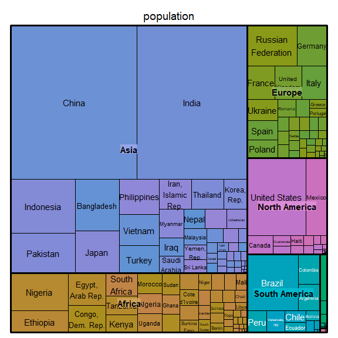
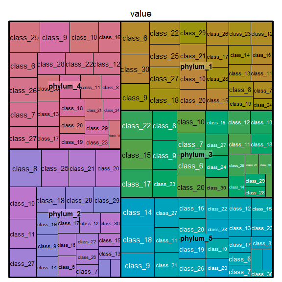
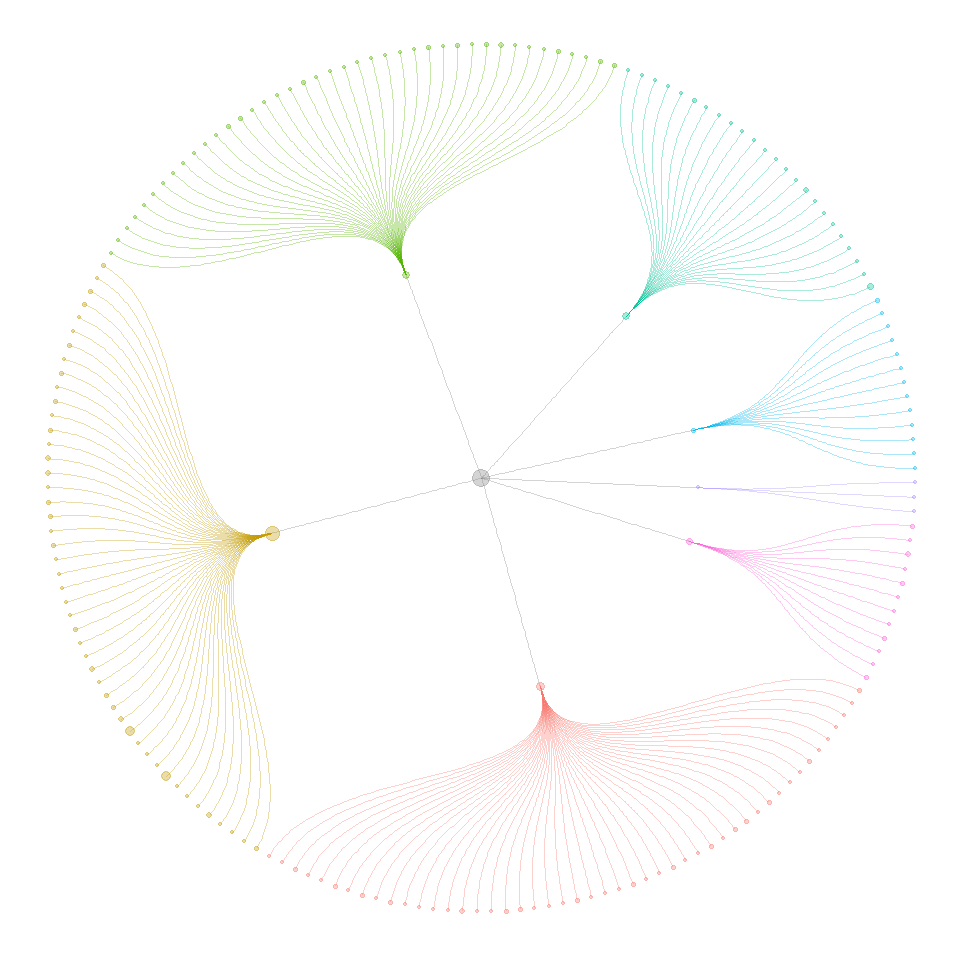
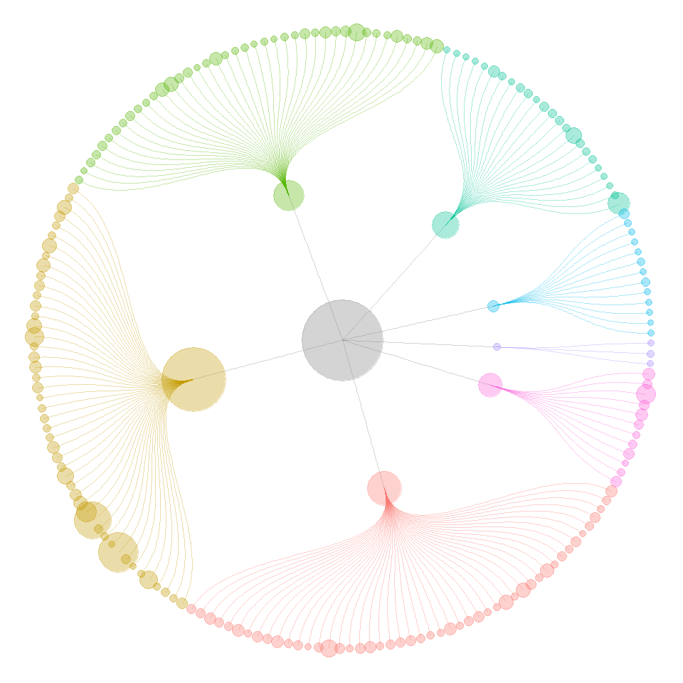
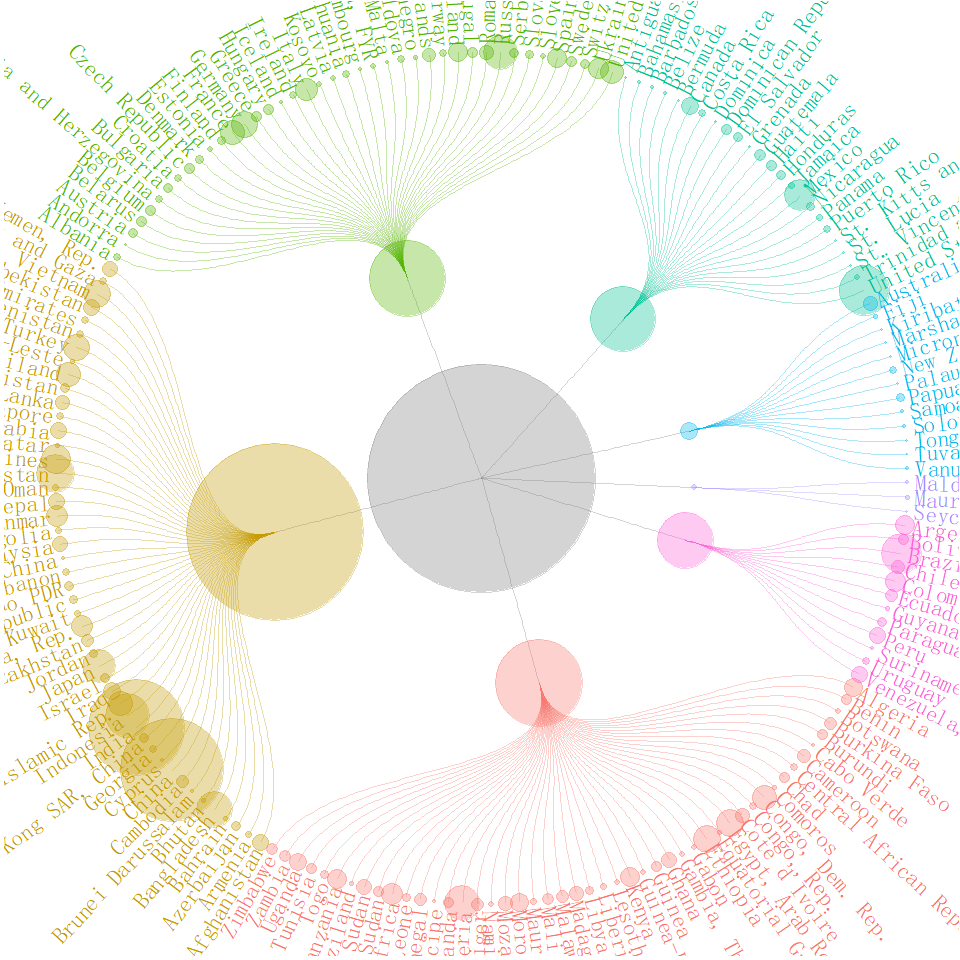
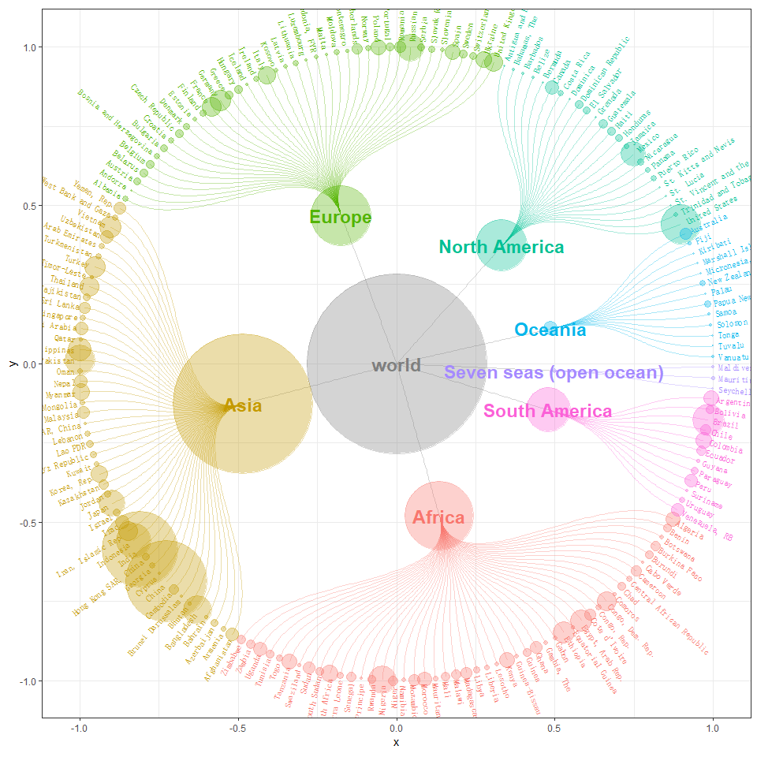
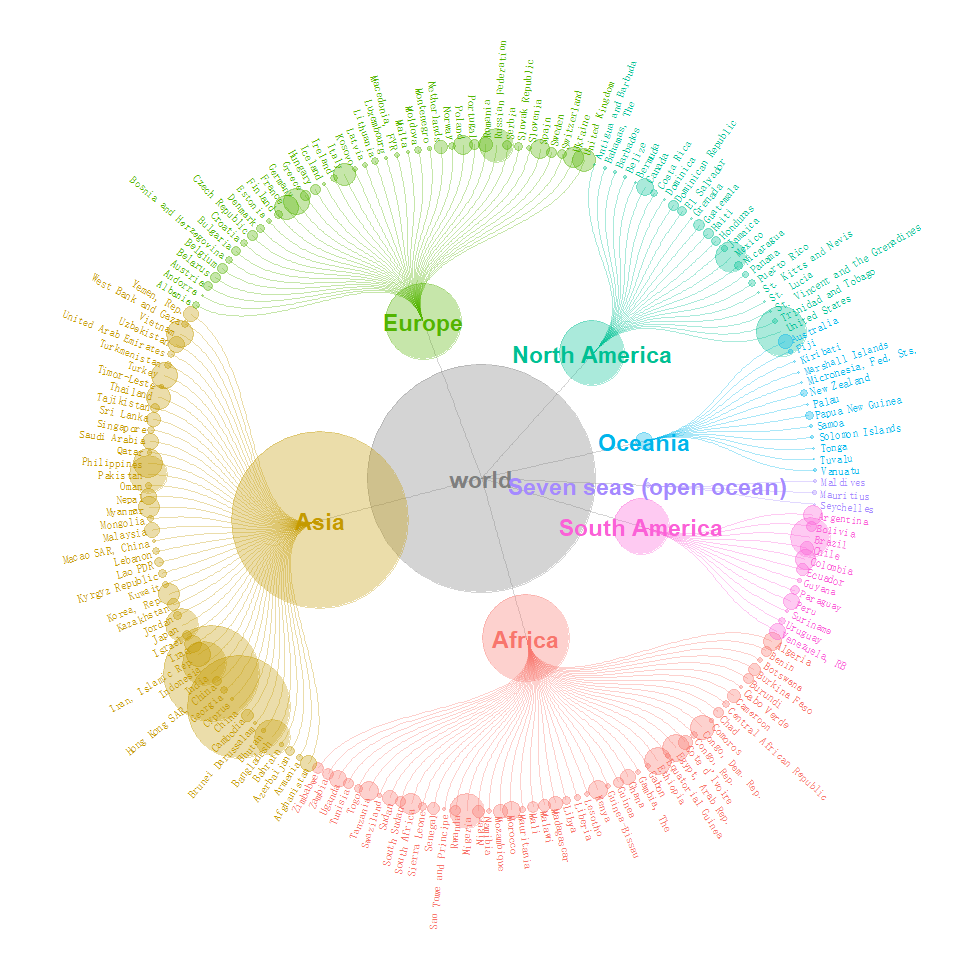
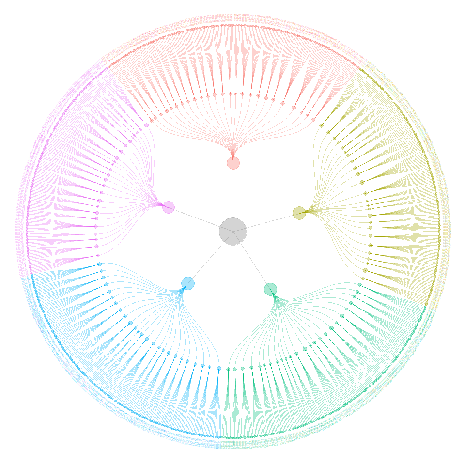
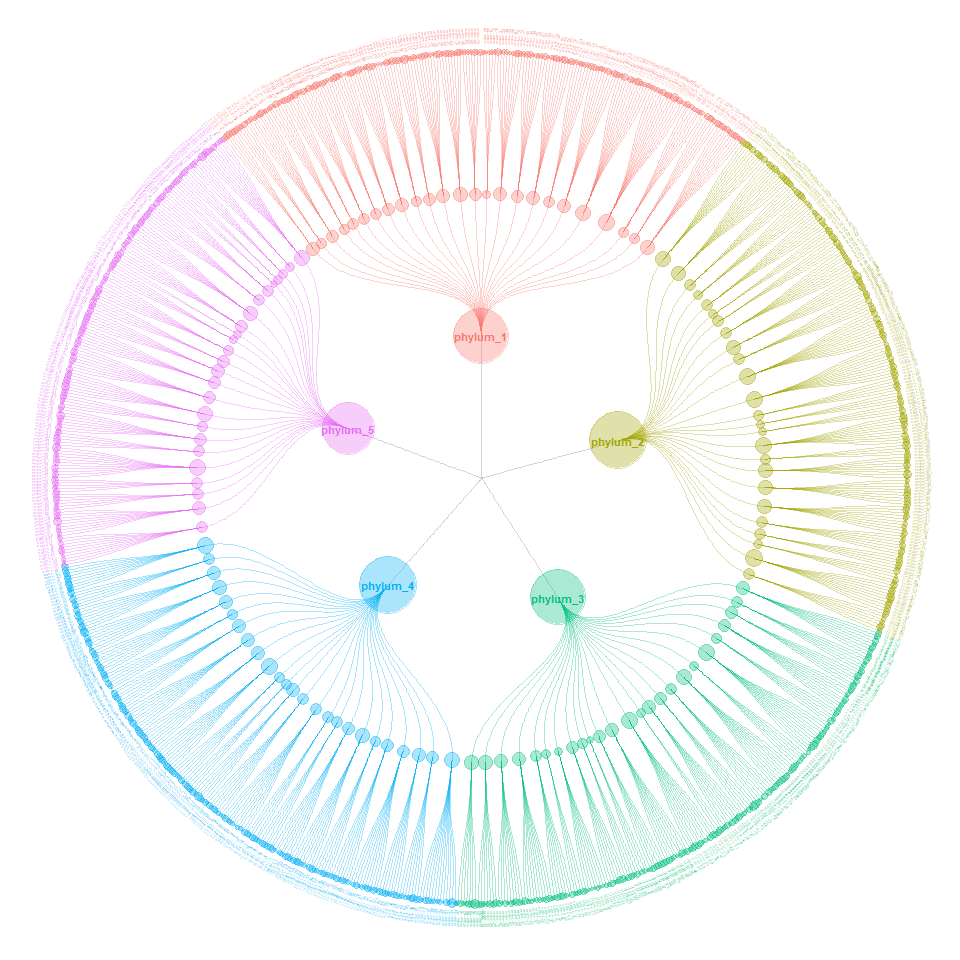

小丫画图 ccgraph 首发礼
================
高春辉
2019-12-05

  - [`ccgraph`](#ccgraph)
      - [安装](#安装)
      - [载入需要的包](#载入需要的包)
      - [图的说明](#图的说明)
      - [输入数据格式](#输入数据格式)
  - [数据处理](#数据处理)
  - [可视化](#可视化)
      - [搞大你的点](#搞大你的点)
      - [添加注释文字](#添加注释文字)
          - [外环文字](#外环文字)
          - [内环文字](#内环文字)

<!-- README.md is generated from README.Rmd. Please edit that file -->

# `ccgraph`

*严格意义上说，`ccgraph` 并不是一个真正意义上的 “包”。我们选择以 Package 的形式发布，是为了方便使用和传播。*

`ccgraph` 中的 `cc` 是 `circle circle` 的意思，`graph` 是 **图**，意味着使用它可以在 R
环境下绘制 “圆环套圆环” 的 “图”。

之所以把 “图” 加粗，是因为此图非一般意义上的图，而特指图论中描述的图，即对应英文中的 “graph”。

“圆环套圆环”的说法来自于电影《无极》，以及搞笑片“一个馒头引发的血案”。没有看过的不妨去看看。

## 安装

既然是一个包，那么是需要安装才能使用的。我们提供了 `ccgraph.tar.gz` 文件，聪明如你，具体方法应该不用多说了。

当然，也可以把包解压缩，把其中的两个函数定义（`R/gather_graph_node.R` 和 `R/gather_graph_edge.R`
导入当前环境，同样可以正常运行。这种情况不需要安装。

## 载入需要的包

``` r
# load packages
library(tidyverse)
library(ggraph)
library(ccgraph)
```

## 图的说明

这个图来自于 [这篇文献](https://doi.org/10.1093/jnci/djy156) 的 Figure 1。
原文的用途是标明测序在若干基因发现的 SNP/Indel/CNV 突变（多态性差异）。 例如，在
TP53 基因中发现了最多的多态性，包括 CNV 差异 SPLICE 8 个，单核苷酸位点差异 R273H 5 个等。
由于差异用点的大小表示，所以很容易发现常见的多态性差异。


稍作观察便可发现，本图是一个“圆环套圆环”的布局，中心处在中央，下一级的项目分别处在外环。图中只有二环，如果要扩展成五环，多显示几个层次应该也不错。

因此，本图也使用用于展示其它类型的的层级结构。例如上游调控因子调控下游基因的层级和强度，宏基因组测序中发现的物种的丰度等信息。

## 输入数据格式

[**FuncTree**工具](https://bioviz.tokyo/functree)
可以出类似这样的图，但是它的输入数据格式非常复杂（见下表）。需要针对每一个点做有针对性的设置。

| Input                             | Description                                                             |
| --------------------------------- | ----------------------------------------------------------------------- |
| n-map00010 v-120                  | map circle of size 120 on node “map00010”                               |
| n-1881 v-78 o-0.3                 | map circle of size 78 with opacity value 0.3 on node “1881” (“M00281”)  |
| n-map00030 v-12                   | map circle of size 120 with default opacity value(1) on node “map00030” |
| n-map00190 v-149 o-0.9 c-\#ff0000 | map red circle of size 149 with opacity value 0.9 on node “map00149”    |

**[tidytuesday](https://github.com/spren9er/tidytuesday)**
提供了一个挺酷炫的解决方案，应该是个正确的努力方向。

所以决定用 `ggraph` 来画这个图。为此，花了几天时间仔细研究了这个包，写下了一篇长文：[一文读懂 ggraph
的使用](https://mp.weixin.qq.com/s/XYVW7wzJIPaHCpBR7j3coQ)

上面提到，树状的结构在生活中很常见。本来想用文献中的数据重现图片，但是无奈上面的文献中没有提供原始数据。于是选了两个数据在开发中验证功能。

一个数据是 `treemap` 附带的 `GNI2014` 数据。 这个数据是 2014 年以美元计算的人均国民总收入和每个国家的人口总数。

**祝贺澳门特别行政区跻身前五名。**

``` r
library(treemap)
data("GNI2014")

GNI2014 %>% arrange(desc(GNI)) %>% head(20) 
#>    iso3          country     continent population    GNI
#> 1   BMU          Bermuda North America      67837 106140
#> 2   NOR           Norway        Europe    4676305 103630
#> 3   QAT            Qatar          Asia     833285  92200
#> 4   CHE      Switzerland        Europe    7604467  88120
#> 5   MAC Macao SAR, China          Asia     559846  76270
#> 6   LUX       Luxembourg        Europe     491775  75990
#> 7   AUS        Australia       Oceania   21262641  64540
#> 8   SWE           Sweden        Europe    9059651  61610
#> 9   DNK          Denmark        Europe    5500510  61310
#> 10  USA    United States North America  313973000  55200
#> 11  SGP        Singapore          Asia    4657542  55150
#> 12  NLD      Netherlands        Europe   16715999  51890
#> 13  CAN           Canada North America   33487208  51630
#> 14  AUT          Austria        Europe    8210281  49670
#> 15  KWT           Kuwait          Asia    2691158  49300
#> 16  FIN          Finland        Europe    5250275  48420
#> 17  DEU          Germany        Europe   82329758  47640
#> 18  BEL          Belgium        Europe   10414336  47260
#> 19  IRL          Ireland        Europe    4203200  46550
#> 20  ISL          Iceland        Europe     306694  46350
```

另一个数据是随机生成的一个 OTU 表。

``` r
n <- 1000
microbiome <- data.frame(
  otu = paste("OTU",1:n,sep="_"),
  phylum = sample(paste("phylum",1:5,sep="_"),n,replace = T),
  class = sample(paste("class",6:30,sep="_"),n,replace=T),
  order = sample(paste("order",31:80,sep="_"),n,replace = T),
  value = runif(n,min=1,max=1000)
)
```

这两个数据都可以使用 `treemap()` 来做一个可视化。

``` r
treemap(GNI2014,index=c("continent","country"),vSize = "population")
```



``` r
treemap(microbiome,index = c("phylum","class"),vSize = "value")
```



# 数据处理

图由两个部分组成，节点（node）和边（edge）。处理数据就是要从上面的数据框中采集节点和边的信息。

为此，我分别写了两个函数：`gather_graph_node()` 和 `gather_graph_edge()` 来完成这一个任务。

这两个函数的参数设置借鉴了上面 `treemap()` 的实现方式。

  - `df`：一个数据框
  - `index`：一个索引项（分组项）
  - `value`：要采集的数值

<!-- end list -->

``` r
country_index <- c("continent","country")
nodes_country <- gather_graph_node(GNI2014,index = country_index, value = "population",root="world")
edges_country <- gather_graph_edge(GNI2014,index = country_index,root="world")
```

为了确保 `node.name` 的唯一性，在图中使用了长名，而把原有的名字放在 `node.short_name` 中去了。

`node.level` 则用来指示节点应该处于第几个圆环。

``` r
head(nodes_country,10)
#>                  node.name  node.size node.level node.count         node.short_name
#> 1                    world 6683146875       <NA>          1                   world
#> 2                   Africa  962382035  continent         48                  Africa
#> 3                     Asia 4033277009  continent         47                    Asia
#> 4                   Europe  728669949  continent         41                  Europe
#> 5            North America  528748158  continent         24           North America
#> 6                  Oceania   33949312  continent         13                 Oceania
#> 7  Seven seas (open ocean)    1768074  continent          3 Seven seas (open ocean)
#> 8            South America  394352338  continent         12           South America
#> 9           Africa/Algeria   34178188    country          1                 Algeria
#> 10            Africa/Benin    8791832    country          1                   Benin
#>                node.branch
#> 1                     <NA>
#> 2                   Africa
#> 3                     Asia
#> 4                   Europe
#> 5            North America
#> 6                  Oceania
#> 7  Seven seas (open ocean)
#> 8            South America
#> 9                   Africa
#> 10                  Africa
```

节点的属性统一以 `node` 作为前缀，而边的属性则以 `edge` 作为前缀。

``` r
head(edges_country,10)
#> # A tibble: 10 x 2
#>    from          to                     
#>    <chr>         <chr>                  
#>  1 world         Africa                 
#>  2 world         Asia                   
#>  3 world         Europe                 
#>  4 world         North America          
#>  5 world         Oceania                
#>  6 world         Seven seas (open ocean)
#>  7 world         South America          
#>  8 North America North America/Bermuda  
#>  9 Europe        Europe/Norway          
#> 10 Asia          Asia/Qatar
```

# 可视化

有了节点和边的数据，使用 `tbl_graph()` 便可以得到一个图。

``` r
library(tidygraph)
graph_country <- tbl_graph(nodes_country,edges_country)
```

然后使用 `ggraph` 出图，基本上就是这个意思了。

``` r
gc <- ggraph(graph_country,layout = 'dendrogram', circular = TRUE) + 
  geom_edge_diagonal(aes(color=node1.node.branch),alpha=1/3) + 
  geom_node_point(aes(size=node.size,color=node.branch),alpha=1/3) + 
  coord_fixed() +
  theme(legend.position = "none")

gc
```



当然，要想达到示例图片中的效果，还需要做一些修饰。

## 搞大你的点

使用 `scale_size()` 和 `scale_size_*()` 系列函数可以搞大你的点。

[搞大你的点](https://mp.weixin.qq.com/s/JNIncz3W-59yjGk2ibJWUw)

``` r
gc + scale_size(range = c(3,40))
```



## 添加注释文字

### 外环文字

``` r
gc + scale_size(range = c(0.5,80)) +
      geom_node_text(
      aes(
        x = 1.0175 * x,
        y = 1.0175 * y,
        label = node.short_name,
        angle = -((-node_angle(x, y) + 90) %% 180) + 90,
        filter = leaf,
        color = node.branch
      ),
      size = 6, hjust = 'outward'
    )
```



### 内环文字

``` r
gc1 <- gc + scale_size(range = c(0.5,80)) +
    geom_node_text(
    aes(
      x = 1.0175 * x,
      y = 1.0175 * y,
      label = node.short_name,
      angle = -((-node_angle(x, y) + 90) %% 180) + 90,
      filter = leaf,
      color = node.branch
    ), 
    size = 3, hjust = 'outward'
    ) +
  geom_node_text(
    aes(label=node.short_name,
        filter = !leaf,
        color = node.branch),
    fontface="bold",
    size=6,
    family="sans"
  )
```

标签文字出界了，导致显示不完全。扩大坐标轴可以解决这个问题。

**注**：图的坐标系是不显示的，其实是 \[-1,1\] 的区间。

``` r
gc1 + theme_bw() + theme(legend.position = "none")
```



要扩大坐标系，使用下面的命令即可。然后使用 `ggsave()` 保存。

``` r
gc1 + coord_cartesian(xlim=c(-1.3,1.3),ylim = c(-1.3,1.3))
#> Coordinate system already present. Adding new coordinate system, which will replace the existing one.
```



``` r
ggsave("country.png",width = 10,height = 10)
```

如果需要矢量图，则可以使用 `export` 包（参见
[这里](https://mp.weixin.qq.com/s/nHT3vkwNfQknr6CLF0cUDQ)）。

``` r
library(export)

graph2ppt(gc1, file="country.pptx")
#> Exported graph as country.pptx
```

`PPT` 格式与 `png` 会有些差异，但都是可以编辑的（当然可以调整参数后再输出）。可以很方便的把不需要的节点和边删掉。

类似的，我们也可以对随机生成的 OTU table 做一个可视化。

``` r
index_micro <- c("phylum","class","order")
nodes_micro <- gather_graph_node(microbiome,index=index_micro, root="Bac")
edges_micro <- gather_graph_edge(microbiome,index=index_micro, root="Bac")

graph_micro <- tbl_graph(nodes_micro,edges_micro)
```

在打标签这一步，`leaf` 是 `ggraph(gr, layout="dendrogram", circular = TRUE)`
自动变换的结果，指示是否是最末端的树叶。

在这里由于分了多个层次，所以要再加上一个 `filter`。

``` r
gm <- ggraph(graph_micro,layout = 'dendrogram', circular = TRUE) + 
  geom_edge_diagonal(aes(color=node1.node.branch),alpha=1/3) + 
  geom_node_point(aes(size=node.size,color=node.branch),alpha=1/3) + 
  coord_fixed() +
  theme(legend.position = "none") +
  scale_size(range = c(0.5,20)) +
    geom_node_text(
    aes(
      x = 1.0175 * x,
      y = 1.0175 * y,
      label = node.short_name,
      angle = -((-node_angle(x, y) + 90) %% 180) + 90,
      filter = leaf,
      color = node.branch
    ), 
    size = 1, hjust = 'outward'
    )
gm
```



`gm` 本身既是一幅图，也是一个数据。

``` r
attributes(gm)
#> $names
#> [1] "data"        "layers"      "scales"      "mapping"     "theme"       "coordinates" "facet"      
#> [8] "plot_env"    "labels"     
#> 
#> $class
#> [1] "ggraph" "gg"     "ggplot"
```

`gm$data` 包含绘图时使用的坐标系。

``` r
head(gm$data,10)
#>             x             y  leaf         node.name  node.size node.level node.count node.short_name
#> 1  0.00000000  0.0000000000 FALSE               Bac 501473.086       <NA>          1             Bac
#> 2  0.28879923 -0.1664515386 FALSE          phylum_1  96267.932     phylum        191        phylum_1
#> 3 -0.05023042 -0.3295269579 FALSE          phylum_2  91926.615     phylum        196        phylum_2
#> 4 -0.32986834 -0.0479373607 FALSE          phylum_3 103372.673     phylum        207        phylum_3
#> 5 -0.13477663  0.3048710746 FALSE          phylum_4 109462.019     phylum        214        phylum_4
#> 6  0.25567075  0.2138774908 FALSE          phylum_5 100443.847     phylum        192        phylum_5
#> 7  0.66553899  0.0387594830 FALSE phylum_1/class_10   5034.082      class         11        class_10
#> 8  0.66666648  0.0004967102 FALSE phylum_1/class_11   3930.509      class          8        class_11
#>   node.branch .ggraph.orig_index circular .ggraph.index
#> 1        <NA>                  1     TRUE             1
#> 2    phylum_1                  2     TRUE             2
#> 3    phylum_2                  3     TRUE             3
#> 4    phylum_3                  4     TRUE             4
#> 5    phylum_4                  5     TRUE             5
#> 6    phylum_5                  6     TRUE             6
#> 7    phylum_1                  7     TRUE             7
#> 8    phylum_1                  8     TRUE             8
#>  [ reached 'max' / getOption("max.print") -- omitted 2 rows ]
```

因此，我们可以在这个数据上做些雕琢，随心所欲的加标签。

``` r
gm + geom_node_text(
    aes(label=node.short_name,
        color = node.branch),
    fontface="bold",
    size=3,
    family="sans",
    data = filter(gm$data, node.level=="phylum"),
  )
```


当然，也可以去掉 `root`。

``` r
gm0 <- ggraph(graph_micro,layout = 'dendrogram', circular = TRUE)

gm0 + geom_edge_diagonal(aes(color=node1.node.branch),alpha=1/3,
                         data = ) + 
  geom_node_point(aes(size=node.size,color=node.branch),alpha=1/3,
                  data = filter(gm0$data, !is.na(node.level))) + 
  coord_fixed() +
  theme(legend.position = "none") +
  scale_size(range = c(0.5,20)) +
    geom_node_text(
    aes(
      x = 1.0175 * x,
      y = 1.0175 * y,
      label = node.short_name,
      angle = -((-node_angle(x, y) + 90) %% 180) + 90,
      filter = leaf,
      color = node.branch
    ), 
    size = 1, hjust = 'outward'
    ) +
  geom_node_text(
    aes(label=node.short_name,
        color = node.branch),
    fontface="bold",
    size=3,
    family="sans",
    data = filter(gm0$data, node.level=="phylum"),
  )
```


